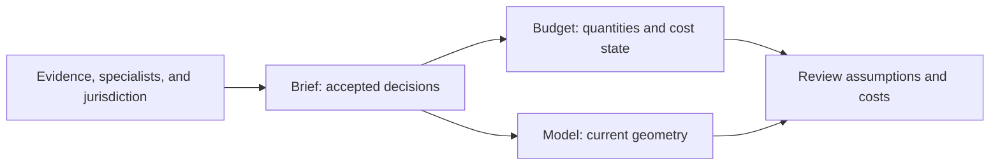

# Record flow

```mermaid
flowchart LR
  B[Brief: accepted decisions] --> Q[Budget: quantities and cost state]
  B --> M[Model: current geometry]
  Q --> R[Review assumptions and costs]
  M --> R
  E[Evidence, specialists, and jurisdiction] --> B
```

The demo shell is only a neutral starting point. Evidence and professional work may change the brief; then reconcile the affected budget quantities and model geometry.
